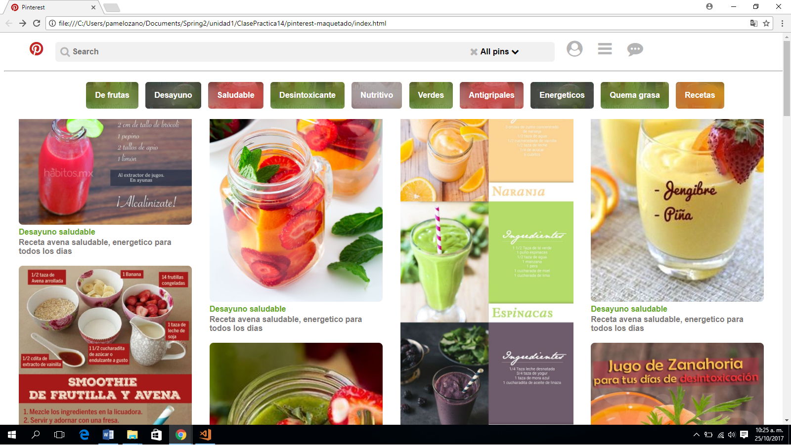

## Pinterest Maquetado
Este repositorio contiene el desarrollo de maquetacion del ejercicio (Pinterest) poniendo en práctica lo aprendido en clases y el self learnig estructuras HTML y hoja de estilo CSS.

### Pondremos en práctica lo siguiente:
1. Aplicaremos **selectores:**
    * Selector elemento
    * Selector descendiente

2. Aplicaremos __"elementos que componen el modelo de caja"__
    * Padding **(relleno)**.
    * Margin **(margen)**

3. Aplicaremos la __"propiedad de los elementos de caja""__
    * display **(por bloques)**
    * background-color **(Color al bloque)**
    * color **(para el contenido)**
    * font-family: **'Times New Roman'**
    * font-weight
    * text-align
    * opacity

4. Aplicaremos el valor de la propiedad __"Positioning"__
    * relative
### Herramientas Utilizadas:
1. HTML5
2. CSS3

### Imagen final:
